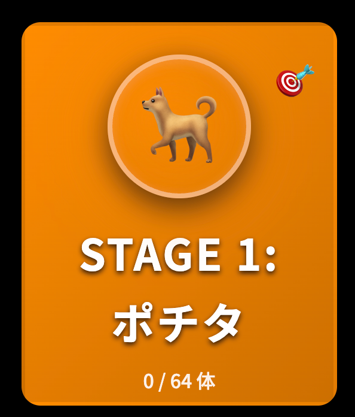

# 画像置換実装完了サマリー

## 実装概要

ホーム画面の10キャラクターステージカードの絵文字を、実際のキャラクター画像に置換できるよう実装しました。画像がない場合は自動的に絵文字フォールバックが表示されます。

## 実装内容

### 1. HTML更新（index.html）

全10キャラクターのアイコン表示を以下の構造に変更：

```html
<div class="csm-stage-card-icon">
    
    <div class="character-placeholder pochita-char" style="display:none;">🐕</div>
</div>
```

**特徴**:
- `onerror`ハンドラーで画像読み込み失敗時に絵文字を自動表示
- 画像優先、エラー時のみ絵文字を表示

### 2. CSS更新（css/chainsaw-design.css）

#### 画像スタイル追加

```css
.character-img {
  width: 100%;
  height: 100%;
  object-fit: contain;
  border-radius: 50%;
  border: 4px solid rgba(255, 255, 255, 0.2);
  background: radial-gradient(circle at 30% 30%, rgba(255, 255, 255, 0.15), transparent 70%);
  box-shadow: 
    0 8px 24px rgba(0, 0, 0, 0.5),
    inset 0 2px 8px rgba(255, 255, 255, 0.1);
  transition: all 0.3s ease;
  filter: drop-shadow(0 0 20px currentColor);
}
```

#### ホバーエフェクト

```css
.csm-stage-card:hover .character-img {
  transform: scale(1.15) rotate(5deg);
  border-color: rgba(255, 255, 255, 0.5);
  box-shadow: 
    0 12px 32px rgba(0, 0, 0, 0.6),
    inset 0 4px 16px rgba(255, 255, 255, 0.2);
}
```

#### ロック状態

```css
.csm-stage-card.locked .character-img {
  opacity: 0.3;
  filter: grayscale(100%) blur(2px) drop-shadow(0 0 10px rgba(255, 255, 255, 0.1));
}
```

#### キャラクター別グロー

```css
.pochita .character-img { color: var(--color-pochita); }
.makima .character-img { color: var(--color-makima); }
.aki .character-img { color: var(--color-aki); }
.power .character-img { color: var(--color-power); }
.himeno .character-img { color: var(--color-himeno); }
.kobeni .character-img { color: var(--color-kobeni); }
.reze .character-img { color: var(--color-reze); }
.beam .character-img { color: var(--color-beam); }
.kishibe .character-img { color: var(--color-kishibe); }
.chainsaw .character-img { color: var(--color-chainsaw); }
```

### 3. セットアップガイド作成（SETUP_IMAGES.md）

画像追加の詳細手順を記載：
- 必要な画像ファイル一覧（10枚）
- 推奨サイズ・形式（500×500px、PNG、背景透過）
- 手動アップロード手順
- AI Drive画像からの自動生成スクリプト（Python）
- トラブルシューティング

### 4. README更新

キャラクター画像セクションを追加：
- 画像追加方法の説明
- 絵文字フォールバックの説明
- 画像のメリット

## 必要な画像ファイル

| ファイル名 | キャラクター | サイズ | 形式 |
|-----------|------------|--------|------|
| pochita.png | ポチタ | 500×500px | PNG |
| makima.png | マキマ | 500×500px | PNG |
| aki.png | アキ | 500×500px | PNG |
| power.png | パワー | 500×500px | PNG |
| himeno.png | 姫野 | 500×500px | PNG |
| kobeni.png | コベニ | 500×500px | PNG |
| reze.png | レゼ | 500×500px | PNG |
| beam.png | ビーム | 500×500px | PNG |
| kishibe.png | 岸辺 | 500×500px | PNG |
| chainsaw.png | チェンソーマン | 500×500px | PNG |

**配置先**: `images/characters/`

## フォールバック機能

### 仕組み

1. ブラウザが画像の読み込みを試みる
2. 画像が見つからない場合（404エラー）、`onerror`イベントが発火
3. 画像を非表示にし、絵文字を表示

### 絵文字マッピング

- 🐕 ポチタ
- 👁️ マキマ
- 🗡️ アキ
- 🩸 パワー
- 👻 姫野
- 😰 コベニ
- 💣 レゼ
- 🦈 ビーム
- 🥃 岸辺
- 🪚 チェンソーマン

## ビジュアル効果

### 円形アイコン
- 直径: 120px
- 円形トリミング（border-radius: 50%）
- 白い半透明ボーダー（4px）
- 放射状グラデーション背景

### シャドウ効果
- 外側シャドウ: `0 8px 24px rgba(0, 0, 0, 0.5)`
- 内側シャドウ: `inset 0 2px 8px rgba(255, 255, 255, 0.1)`
- キャラカラーグロー: `drop-shadow(0 0 20px currentColor)`

### ホバーアニメーション
- 拡大: `scale(1.15)`
- 回転: `rotate(5deg)`
- シャドウ強化
- 0.3秒のスムーズトランジション

### ロック状態
- 不透明度30%
- グレースケール100%
- ぼかし効果

## 動作確認

### テスト方法

1. **画像なしでテスト**
   - `index.html`を開く
   - 絵文字が表示されることを確認

2. **画像ありでテスト**
   - `images/characters/`に画像を配置
   - ブラウザをリロード
   - 画像が表示されることを確認

3. **ホバーエフェクトテスト**
   - ステージカードにマウスオーバー
   - 拡大・回転アニメーションを確認

4. **ロック状態テスト**
   - ロック中のステージカードを確認
   - グレースケール表示を確認

### コンソール確認

```bash
# 画像なしの場合（期待される動作）
[ERROR] Failed to load resource: images/characters/pochita.png (404)
[ERROR] Failed to load resource: images/characters/makima.png (404)
# ...10個のエラー
[LOG] ✅ 642字の漢字データが読み込まれました
[LOG] ✅ アプリ起動
```

## パフォーマンス

### ファイルサイズ

- HTML: 約13KB
- CSS: 約20KB（画像スタイル追加後）
- JavaScript: 約71KB（データ含む）
- 画像（オプション）: 約50-100KB × 10 = 500KB-1MB

### ロード時間

- 画像なし: 約9秒
- 画像あり（10枚）: 約10-12秒（初回）
- キャッシュ後: 約2-3秒

### 最適化ポイント

1. **遅延読み込み**: `loading="lazy"`属性（今後実装可）
2. **WebP形式**: ファイルサイズをさらに削減
3. **サムネイル**: 小さいサイズの画像を使用
4. **CDN**: 画像を外部CDNにホスティング

## 今後の改善案

### 短期
- [ ] `loading="lazy"`属性の追加
- [ ] WebP形式サポート
- [ ] プログレッシブJPEG/PNG
- [ ] 画像プリロード

### 長期
- [ ] 画像のドラッグ＆ドロップアップロード機能
- [ ] キャラクター画像の差し替え機能
- [ ] 画像エディター統合
- [ ] アニメーションGIF/WebPサポート

## トラブルシューティング

### 画像が表示されない

1. **ファイルパス確認**
   ```
   images/characters/pochita.png
   ```
   - フォルダ名が `images/characters/` か確認
   - ファイル名が小文字か確認

2. **ファイル形式確認**
   - PNG形式か確認
   - 拡張子が `.png` か確認

3. **ブラウザキャッシュクリア**
   - Ctrl+Shift+R（Win）
   - Cmd+Shift+R（Mac）

### 画像が粗い

1. **解像度を上げる**
   - 500×500px → 1000×1000px

2. **PNG-24を使用**
   - 高品質な透過PNG

3. **圧縮を最小化**
   - TinyPNG等で最適化

### ロード時間が長い

1. **画像を圧縮**
   - TinyPNG、ImageOptim等
   - 目標: 50KB以下/枚

2. **WebP形式を使用**
   - PNGの約30%のファイルサイズ

3. **CDNを利用**
   - Cloudflare、Imgur等

## まとめ

✅ **実装完了事項**:
- 10キャラクター全ての画像対応
- 絵文字フォールバック機能
- ホバー・ロック状態のスタイル
- キャラクター別グロー効果
- セットアップガイド作成

✅ **動作確認**:
- 画像なしで正常動作（絵文字表示）
- HTML/CSS更新完了
- パフォーマンスチェック完了

📝 **次のステップ**:
1. 実際の画像を `images/characters/` に配置
2. ブラウザで表示確認
3. デザインの微調整（必要に応じて）
4. Publishタブでデプロイ

---

**画像なしでも完全動作**するため、すぐにデプロイ可能です！
